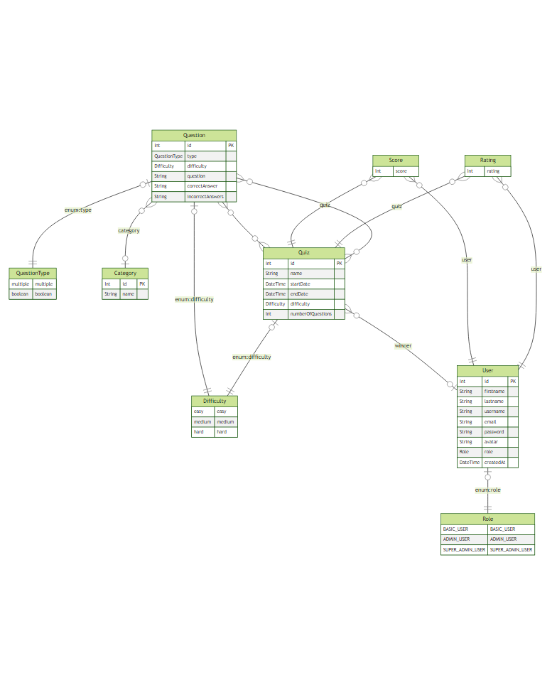

# Readme for assessment-1-node-js-restful-api

## Requirements:
Node version 17 or greater.

## Quickstart:
1. Copy `example.env` to `.env` and fill out the missing variables
2. `npm start`

This project uses the [Zod](https://zod.dev/) validation library.

## Manipulating Prisma
To create a new migration use: 
> `npm run prisma:migrate -- --name <migration_name>`

To see the current data in the database:
> `npm run prisma:studio`

## Entity Relationship Diagram

## References:
Prisma Data, Inc. (2022, June 21). Best practice for instantiating PrismaClient with Next.js. Prisma. Retrieved August 24, 2022, from https://www.prisma.io/docs/guides/database/troubleshooting-orm/help-articles/nextjs-prisma-client-dev-practices

Is there a RegExp.escape function in JavaScript? (2010, August 24). Stack Overflow. Retrieved September 20, 2022, from https://stackoverflow.com/a/3561711

Typescript Error: Property “user” does not exist on type “Request.” (2017, June 6). Stack Overflow. Retrieved September 20, 2022, from https://stackoverflow.com/questions/44383387/typescript-error-property-user-does-not-exist-on-type-request

Robinson, S. (2021, July 16). Encoding and Decoding Base64 Strings in Node.js. Stack Abuse. Retrieved October 5, 2022, from https://stackabuse.com/encoding-and-decoding-base64-strings-in-node-js/

Au-Yeung, J. (2022, September 2). How to extending error class with TypeScript? The Web Dev. Retrieved October 11, 2022, from https://thewebdev.info/2022/05/12/how-to-extending-error-class-with-typescript/

## TODO:
### User:
You will have three types of users:
- [x] super admin
- [x] admin
- [x] basic user

- [x] Each user will have the following information: 
  - [x] first name
  - [x] last name
  - [x] username
  - [x] email address
  - [x] profile picture
  - [x] password
  - [x] confirm password
  - [x] role. 

  > The users’ profile picture will be from the following API https://avatars.dicebear.com/docs/http-api. Each profile picture should be, in most cases, different. I suggest using random seed when setting the user’s profile picture.

- [ ] Each user can login, logout, get their information & update their information. A super admin user
can get all users’ information, update all admin & basic users’ information & delete all admin &
basic users. An admin user can get all admin & basic users’ information & update all basic users’
information. A basic user can register.
  - [x] All user types can login and logout
  - [x] Basic user can GET /user and get their own information
  - [x] Admin user can GET /user and get all BASIC_USERS and ADMIN_USERS
  - [x] Super admin user can GET /user and get all BASIC_USERS, ADMIN_USERS & SUPER_ADMIN_USERS
  - [x] Basic user can GET /user/:id where id is their own id
  - [x] Admin user can GET /user/:id where the role is BASIC_USER & ADMIN_USER
  - [x] Super admin user can GET /user/:id where the role is BASIC_USER, ADMIN_USER & SUPER_ADMIN_USER
  - [x] Basic user can PUT /user/:id where id is their own id
  - [x] Admin user can PUT /user/:id where id is their own id
  - [x] Admin user can PUT /user/:id where the role is BASIC_USER
  - [x] Super admin user can PUT /user/:id where id is their own id
  - [x] Super admin user can PUT /user/:id where the role is BASIC_USER & ADMIN_USER
  - [x] Super admin user can DELETE ADMIN_USER and BASIC_USER

When performing a POST request for registering a basic user, the following error checking must be implemented:
  - [x] First name has a minimum length of two characters, a maximum length of 50 characters & alpha characters only.
  - [x] Last name has the same error checking as first name above.
  - [x] Username is unique, has a minimum length of five characters, maximum length of ten characters & alphanumeric characters only, i.e., johndoe123.
  - [x] Email address is unique, contains the username above, an @ special character & a second-level domain, i.e., johndoe123@email.com.
  - [x] Password has a minimum length of eight characters, maximum length of 16 characters & contains one numeric character & one special character.
  - [x] Confirm password is the same as the password above.
  > Note: Confirm password will not be a field in the User table. Rather, it will be used to validate the user’s password. 
  > For each error check, a status code & response message is returned, i.e., ”First name must have a minimum length of two characters”.

- [x] When performing a POST request for logging in a user using either username/password or email
address/password, return a status code, a response message, i.e., ”<User’s username> has successfully
logged in” & the user’s JWT.

- [x] When performing a GET request for logging out a user, return a status code, a response message,
i.e., ”<User’s username> has successfully logged out” & set the user’s JWT to expired.

- [x] When performing a PUT & DELETE request, return a status code & a response message, i.e.,
”<User’s username>’s information has successfully updated” or ”<User’s username> has successfully
deleted”.

- [x] Two super admin users are seeded via you. Only you can seed the two super admin users. The
super admin users’ data will be fetched from a local file & inserted into the User table using
Prisma.

- [x] Five admin users are seeded via a super admin user. Only a super admin user can seed the five
admin users. The admin users’ data will be fetched from a private GitHub Gist using Axios &
inserted into the User table using Prisma.

- [x] Five basic users are seeded via a super admin or an admin user. Only a super admin or an
admin user can seed the five basic users. The basic users’ data will be fetched from a private
GitHub Gist using Axios & inserted into the User table using Prisma.

### Quiz:
- [x] Each quiz will have the following information: name, start date, end date, category, difficulty,
type, number of questions, list of questions, list of correct answers, list of incorrect answers, list
of scores, average score, list of ratings, average rating & overall winner. The category, list of questions, list of correct answers & list of incorrect answers will be fetched from the following API -
https://opentdb.com/api config.php. The difficulties will be easy, medium & hard. The types will be
multiple choice or true/false.
Each user can: 
- [x] get all quizzes, get all past quizzes, get all present quizzes, get all future quizzes
- [x] get a list of scores 
- [x] get a list of ratings.
- [x] A super admin & an admin user can create a quiz.
- [x] A super admin user can delete a quiz. 
- [x] A basic user can participate in a quiz & rate a quiz.
- [x] When performing a POST request for creating a quiz, the following error checking must be implemented:
  - [x] Name has a minimum length of five characters, a maximum length of 30 characters & alpha
characters only.
  - [x] Start date has to greater than today’s date.
  - [x] End date has to greater than the start date & no longer than five days.
  - [x] Number of questions has to be ten.
For each error check, a status code & response message is returned, i.e., ”Name must have a minimum
length of five characters”.
- [x] When performing a POST request for a basic user who is participating in a quiz, the following error
checking must be implemented:
  - [x] Can not participate if today’s date is before the start date & after the end date.
  - [x] Answered all ten questions.
- [x] When performing a POST request for a basic user who has participated in a quiz, return a status
code, a response message, i.e., ”<User’s username> has successfully participated in <Quiz’s name>”,
user’s score & quiz’s average score.
### HTTP:
- [x] When performing a GET request for /api/v2/, return a response containing all available endpoints
in the RESTful API.
- [x] Headers are secured using Helmet.
- [ ] Implement CORS, compression, caching & rate limiting.
### Testing:
- [x] API tests are written using Mocha & Chai.
- [x] At least 40 API/integration tests verifying the user & quiz functionality.
- [ ] Code coverage using c8.
### Deployment:
- [ ] RESTful API is deployed to Heroku.
### NPM scripts:
- [x] Opening Prisma Studio.
- [x] Creating a migration using Prisma.
- [x] Linting & fixing your code using ESLint.
- [x] Formatting your code using Prettier.
- [x] Running API/integration tests using Mocha.
- [ ] Running code coverage using c8 & Mocha.
